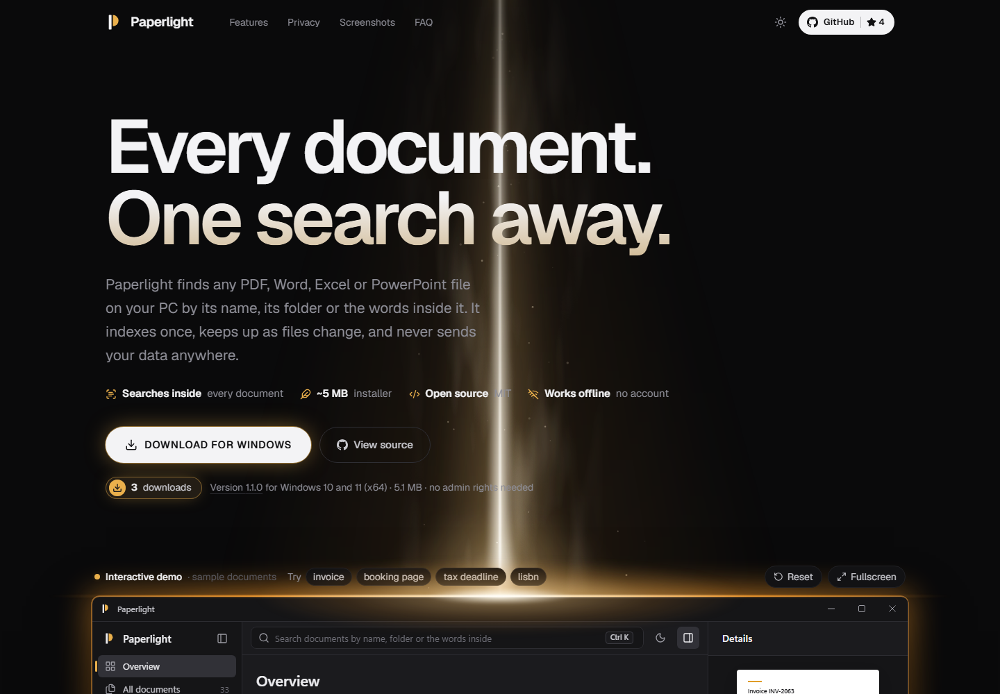

<p align="center">
  
</p>

<h1 align="center">Paperlight</h1>

<p align="center">
  <b>Every document on your PC, one search away.</b><br>
  A free, open-source Windows app that finds any PDF, Word, Excel or PowerPoint file<br>
  by its name, its folder or the words inside it.
</p>

<p align="center">
  <a href="https://paperlight.vercel.app"><b>Website</b></a> ·
  <a href="https://github.com/webKing021/paperlight/releases/latest"><b>Download for Windows</b></a> ·
  <a href="https://github.com/webKing021/paperlight">Source code</a>
</p>

<p align="center">
  <a href="https://github.com/webKing021/paperlight/releases/latest"></a>
  <a href="LICENSE"></a>
</p>



## What Paperlight does

Documents pile up in Downloads, on the Desktop, in project folders and on old drives.
Paperlight reads them once, keeps up as they change, and puts any of them a few keystrokes away.

- **Search inside documents.** Names, folders and the text of PDF, Word, Excel and PowerPoint
  files. Prefixes work, typos are forgiven, and the matching passage is highlighted.
- **Quick search from any app.** Press <kbd>Alt</kbd>+<kbd>Space</kbd>, type a few letters,
  press <kbd>Enter</kbd>. The document opens.
- **Always current.** New, renamed, moved and deleted files show up within a second, with no
  rescans.
- **Organise without touching files.** Favourites, tags, recently opened and previews live in
  Paperlight; your files stay exactly where they are.
- **Duplicates and storage.** Find byte-identical copies and see what takes space. Nothing is
  ever deleted for you.
- **Private and light.** Works offline, no telemetry, no account. A ~5 MB installer and about
  6 MB of memory in the tray.
- **Updates itself, if you want.** New versions install from inside the app in a few seconds,
  keeping your index, favourites and tags.

Free for Windows 10 and 11 (64-bit), no admin rights needed.
[Download the latest version](https://github.com/webKing021/paperlight/releases/latest).

## This repository

The source of Paperlight's website, [paperlight.vercel.app](https://paperlight.vercel.app).
The app itself lives in [webKing021/paperlight](https://github.com/webKing021/paperlight).

- **An interactive demo.** A working copy of the app with made-up sample documents: search,
  typos, previews and quick search all work in the browser.
- **Always up to date.** The version, the installer and the download count come straight
  from GitHub.
- **Two moods.** A lamp shining onto the app in the dark theme, morning sun through a window
  in the light theme.
- **Nothing to hide.** No tracking, no cookies, fonts served from the site itself.

To run it on your computer:

```bash
npm install
npm run dev
```

Built with React, TypeScript, Tailwind CSS and Vite.

---

Made by [webKing021](https://github.com/webKing021) and [Opus 5.5](https://www.anthropic.com/claude).
[MIT](LICENSE) licensed.
